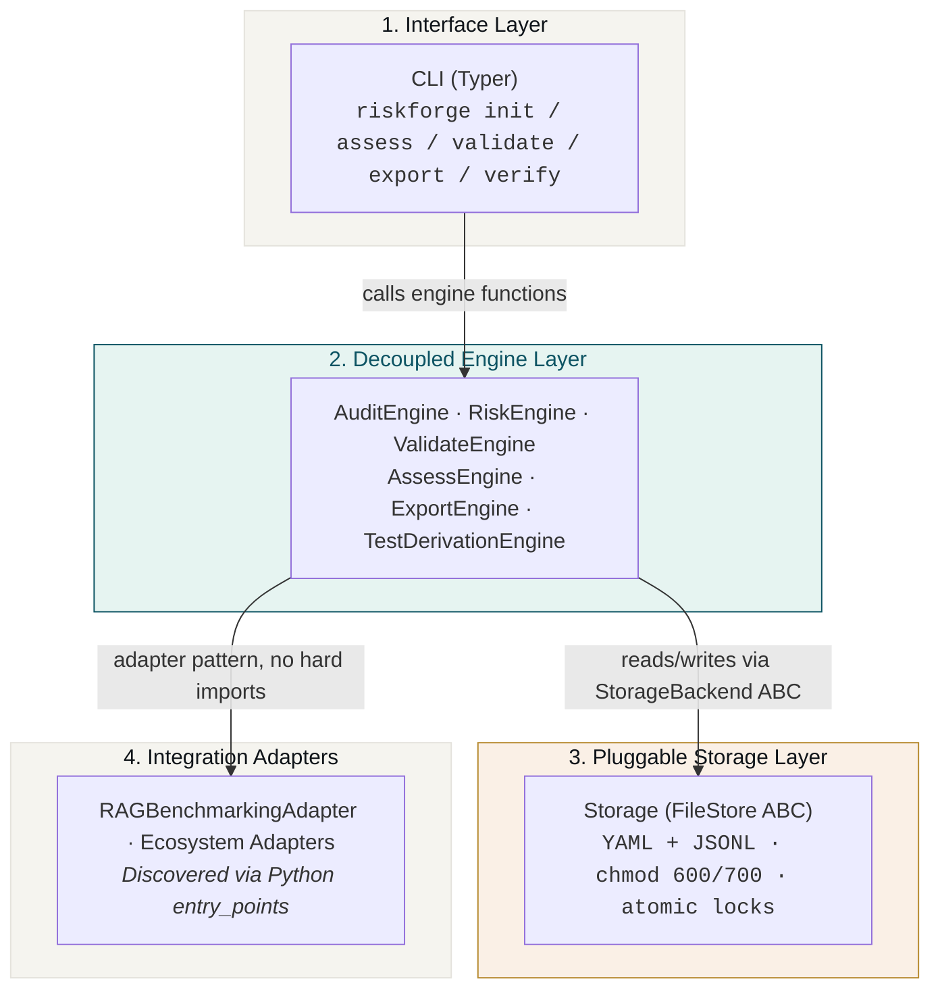
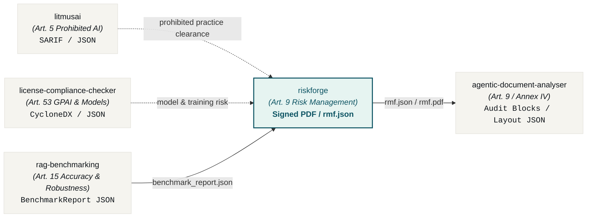
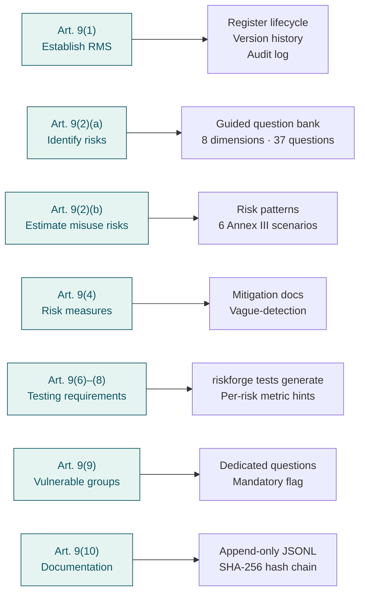

<div align="center">
  <picture>
    <source media="(prefers-color-scheme: dark)" srcset="https://raw.githubusercontent.com/aiexponent/riskforge/main/.github/brand/og-riskforge-dark.png">
    <source media="(prefers-color-scheme: light)" srcset="https://raw.githubusercontent.com/aiexponent/riskforge/main/.github/brand/og-riskforge-light.png">
    
  </picture>
  <h1 align="center">RiskForge</h1>
  <p align="center"><em>EU AI Act Article 9 risk management, as a developer workflow.</em></p>
  <p align="center">
    <a href="https://pypi.org/project/riskforge/"></a>
    <a href="https://github.com/aiexponent/riskforge/actions"></a>
    <a href="LICENSE"></a>
    <a href="https://www.python.org/downloads/"></a>
    <a href="https://eur-lex.europa.eu/legal-content/EN/TXT/?uri=CELEX:32024R1689"></a>
    <a href="#privacy"></a>
    <a href="#evidence-status"></a>
  </p>
</div>

---

> **RiskForge produces structured, hash-chained regulatory evidence for EU AI Act Article 9 (Risk Management System) and Annex IV (Technical Documentation). Apache 2.0, AS IS.**
>
> RiskForge turns high-risk compliance into a 30-minute developer workflow, outputting a cryptographic self-verifying SHA-256 digest designed for technical documentation packs and conformity audits. RiskForge is an engineering workflow tool that automates evidence production and governance controls; it is **not** a notified body and does not constitute formal legal certification.

---

## The Problem

Under the EU AI Act ([Regulation (EU) 2024/1689](https://eur-lex.europa.eu/legal-content/EN/TXT/?uri=CELEX:32024R1689)), providers and deployers of **high-risk AI systems** (governed by Article 6 and Annex III) face mandatory statutory obligations to establish, document, and maintain a continuous **Risk Management System (Article 9)** throughout the entire AI lifecycle.

* **Provisional Enforcement Deadline**: Stand-alone high-risk systems under Annex III must comply by **2 December 2027** (under the Digital Omnibus simplification package).
* **Statutory Non-Compliance Penalties**: Fines up to **€15,000,000 or 3% of total worldwide annual turnover**.
* **The Compliance Bottleneck**: Engineering and MLOps teams cannot afford multi-month, €100K+ Big 4 advisory engagements for every model iteration or system change.

**RiskForge** answers the essential high-risk compliance requirement directly in your terminal or CI/CD pipeline:

> *"How do we continuously assess, mitigate, and mathematically prove Article 9 compliance without blocking product velocity?"*

Run through a guided, 37-question evaluation across **8 statutory risk dimensions**. RiskForge produces a tamper-evident Risk Management File (JSON, PDF, or Markdown) with an unbroken SHA-256 hash chain and cross-regulatory mappings (ISO/IEC 42001, NIST AI RMF) — in under 30 minutes, 100% offline, and with zero telemetry.

Built by [AI Exponent LLC](https://aiexponent.com). Apache 2.0. Runs entirely offline after `pip install`.

---

## Quick Start

```bash
pip install riskforge
```

> [!NOTE]
> **PDF export prerequisites:** PDF generation uses WeasyPrint, which requires underlying system graphical libraries (Pango, Cairo, GDK-PixBuf, libffi):
> - **Debian / Ubuntu:** `sudo apt-get install -y libpango-1.0-0 libpangocairo-1.0-0 libcairo2 libgdk-pixbuf2.0-0 libffi-dev shared-mime-info`
> - **macOS:** `brew install pango cairo gdk-pixbuf libffi`
> - **Windows:** WSL2 (Ubuntu) is recommended with the Debian/Ubuntu packages above. For native Windows, install the GTK3 runtime libraries.
>
> JSON and Markdown export require no additional system libraries beyond `pip install`.

```bash
# 1. Register your AI system
riskforge init \
  --name "Loan Scoring Model" \
  --sys-version "2.1" \
  --purpose "Automated credit scoring for retail loan applications." \
  --provider "Acme Financial Services" \
  --category essential_services
```

```bash
# 2. Record your Article 6(2) Annex III self-classification (required before export)
riskforge system classify <system-id> --confirm
```

```bash
# 3. Run the guided 8-dimension risk assessment (~30 minutes of thinking)
riskforge assess <system-id> \
  --assessor-name "Alice Chen" \
  --assessor-role "AI Governance Lead"

# For CI or reproducible fixtures, run it non-interactively from a YAML answers file:
#   riskforge assess <system-id> -a "Alice Chen" -r "AI Governance Lead" --answers answers.yaml
```

```bash
# 4. (Optional) Record mitigations and accept residual risk
riskforge risk mitigate <system-id> <risk-id> \
  -m "Remove postcode feature; add demographic parity monitoring" \
  -c preventive --owner "ML Platform" --residual-likelihood 2 --residual-severity 3
riskforge risk accept <system-id> <risk-id> --rationale "Residual within appetite after controls."

# 5. (Optional) Derive Article 9(6)-(8) test requirements per open or knowledge-gap risk
riskforge tests generate <system-id>

# 6. Check completeness before export (exit 1 if a FAIL gate is unmet)
riskforge validate <system-id>

# 7. Export your Article 9 Risk Management File
riskforge export <system-id> --format pdf --output rmf.pdf
riskforge export <system-id> --format json --output rmf.json

# 8. Verify integrity anytime (exit 2 if the file was tampered)
riskforge verify --file rmf.json
```

<p align="center">
  
</p>

---

## Why RiskForge

| Evaluation Method | Cost | Turnaround | Deterministic / Repeatable? | Offline / Zero-Telemetry? |
| :--- | :--- | :--- | :--- | :--- |
| **Big 4 Consulting** | €80K–€350K per system¹ | Weeks | ❌ No (Advisory opinion) | ❌ No (NDAs & data sharing) |
| **Enterprise GRC Platforms** | $60K–$200K/year¹ | Months | ⚠️ Partial | ❌ No (Transfers data to cloud) |
| **Internal Spreadsheets** | "Free" | Days | ❌ No (Human error) | ⚠️ Manual |
| **RiskForge** | **Free (Apache 2.0)** | **~30 min** | **✅ Yes (Deterministic hash)** | **✅ Yes (100% offline, zero network)** |

<sup>¹ Indicative market figures gathered from public Big-4 governance-engagement quotes and 2024–2026 enterprise GRC pricing pages. Not a benchmark study; your mileage will vary by scope, jurisdiction, and incumbent advisor.</sup>

---

## System Architecture

RiskForge has four strictly-decoupled layers with CI-enforced import boundaries (ADR-02):



**State on disk:**

```
your-project/
├── riskforge.yaml                     project manifest (chmod 600)
├── .riskforge/                        (chmod 700)
│   ├── audit.jsonl                    append-only hash-chained audit log
│   ├── audit.lock                     serialises audit appends
│   ├── .nodelete                      deletion sentinel
│   └── systems/<system-id>/
│       ├── system.yaml
│       ├── register.yaml
│       └── mitigations.yaml
└── rmf-<id>-<export>.json             exports land where --output specifies (default: working directory)
```

Plain YAML plus JSONL: readable by regulators without RiskForge installed, and diff-able in GitHub PRs.

---

## AI Exponent Governance Toolchain

RiskForge operates as the Risk Management System (Article 9) cornerstone within the open-source AiExponent governance toolchain:



All interactions occur via plain JSON artifacts on disk. RiskForge never calls external cloud APIs.

---

## EU AI Act Article 9 Coverage



Cross-maps to:
* **NIST AI RMF 1.0**: `GOVERN`, `MAP`, `MEASURE`, `MANAGE`
* **ISO/IEC 42001:2023**: Clauses 6.1, 8.4, and Annex Controls A.6–A.9
* **Colorado AI Act**: SB 24-205 (reset by SB 26-189)
* **Texas AI Framework**: Texas HB 149 (TRAIGA)

---

## Validation Gates

Before every export, `riskforge validate` runs 8 automated gates:

| Gate | Check |
|---|---|
| G1 | All 8 risk dimensions have at least one entry |
| G2 | Article 6(2) Annex III self-classification documented |
| G3 | All high-scoring risks mitigated or accepted with rationale |
| G4 | Knowledge gaps have test requirements |
| G5 | System metadata complete |
| G6 | Assessor identity recorded |
| G7 | Risk score distribution plausible (warns if all scores are low) |
| G8 | No vague mitigation language detected |

---

## Interactive Artifact Previews

<details>
  <summary><b>📄 View Starter <code>system.yaml</code> Template</b></summary>

```yaml
id: "e9b271d4-8521-4f1a-9694-81d3d6e5a401"
name: "Loan Scoring Model"
sys_version: "2.1"
purpose: "Automated credit scoring for retail loan applications."
provider: "Acme Financial Services"
category: "essential_services"
annex_iii_reference: "Annex III point 5(b) (Creditworthiness assessment)"
lifecycle_stage: "development"
created_at: "2026-09-22T08:00:00Z"
```
</details>

<details>
  <summary><b>🔍 View Audit-Ready Risk Management File (<code>rmf.json</code>)</b></summary>

```json
{
  "$schema": "https://schemas.aiexponent.com/riskforge/rmf/v1.0.0",
  "id": "e9b271d4-8521-4f1a-9694-81d3d6e5a401",
  "rmf_schema_version": "1.0.0",
  "generated_at": "2026-09-22T09:00:00Z",
  "sha256_hash": "4e9a3b8d1f2c6e7a0b5d8f3e2a1c9b8d7e6f5a4b3c2d1e0f9a8b7c6d5e4f3a2b",
  "audit_entry_hash": "a7c8e9f0123456789abcdef0123456789abcdef0123456789abcdef012345678",
  "register": {
    "system": {
      "name": "Loan Scoring Model",
      "annex_iii_reference": "Annex III point 5(b) (Creditworthiness assessment)"
    },
    "dimension_summary": {
      "discrimination": { "residual_risk": "ACCEPTABLE" },
      "human_oversight": { "residual_risk": "LOW" },
      "data_governance": { "residual_risk": "LOW" },
      "transparency": { "residual_risk": "LOW" }
    }
  },
  "cross_references": [
    {
      "article_ref": "Art.9(2)(a)",
      "iso42001_ref": "Clause A.7",
      "nist_rmf_ref": "MEASURE 2.9"
    }
  ]
}
```
</details>

---

## CI/CD Integration & Exit Codes

Add RiskForge to your GitHub Actions pipeline as an automated compliance and integrity gate:

```yaml
# .github/workflows/article9-gate.yml
name: EU AI Act Article 9 Compliance Gate
on: [pull_request, push]

jobs:
  rmf-gate:
    runs-on: ubuntu-latest
    steps:
      - uses: actions/checkout@v6
      - uses: actions/setup-python@v6
        with:
          python-version: "3.11"
      - name: Install RiskForge
        run: pip install riskforge
      - name: Validate Article 9 Gates
        run: riskforge validate <system-id>
      - name: Verify Audit Chain Integrity
        run: riskforge verify
```

### Exit Code Contract

RiskForge implements deterministic UNIX exit codes for automated CI/CD gating:

| Exit Code | Meaning | CI Behavior |
| :--- | :--- | :--- |
| `0` | **PASS / VALID** | Risk management file and audit chain are complete and valid. |
| `1` | **GATE FAILURE** | One or more validation gates failed (unmitigated high risks, missing assessor, unclassified system). |
| `2` | **TAMPER DETECTED** | Cryptographic audit log or export verification failed; hash chain discrepancy detected. |
| `3` | **SCHEMA / INPUT ERROR** | Malformed YAML/JSON syntax, missing required fields, or unrecognised system ID. |

---

## CLI Command Reference

| Command | Description |
| :--- | :--- |
| `riskforge init` | Initialize a new RiskForge project or register an AI system definition. |
| `riskforge system classify <id>` | Document and confirm Article 6(2) Annex III self-classification. |
| `riskforge assess <id>` | Run the interactive 8-dimension guided assessment (supports `--answers`). |
| `riskforge risk mitigate <id> <risk-id>` | Document preventive/corrective mitigation controls and re-score residual risk. |
| `riskforge risk accept <id> <risk-id>` | Formally accept residual risk with documented business/technical rationale. |
| `riskforge tests generate <id>` | Generate Article 9(6)–(8) testing requirements for open or knowledge-gap risks. |
| `riskforge validate <id>` | Execute the 8 completeness and quality gates before report generation. |
| `riskforge export <id>` | Export Risk Management File to `pdf`, `json`, or `markdown`. |
| `riskforge verify` | Verify cryptographic SHA-256 hash-chain integrity of audit log and exports. |
| `riskforge risk list <id>` | List all identified risks, severity scores, and mitigation statuses. |
| `riskforge serve` | Launch local inspection web server (*experimental local network use only*). |
| `riskforge --version` | Display version, telemetry status, and licensing information. |

---

## Features

| Feature | Detail |
|---|---|
| **Offline-first** | Zero outbound calls after `pip install`, enforced by `pytest-socket` CI gate |
| **Hash-chained audit** | Every mutation appended to `audit.jsonl` with atomic file locks; `riskforge verify` exits code 2 on tampering |
| **Schema-validated exports** | Every JSON export validated against `rmf.schema.json` before writing |
| **PDF export** | WeasyPrint + Jinja2, no LibreOffice or `wkhtmltopdf` required |
| **Pattern matching** | 6 pre-built risk patterns for common Annex III use cases (credit scoring, hiring, facial recognition, medical imaging, content moderation, criminal risk assessment) |
| **Plugin extensible** | Add question banks, exporters, adapters via `pip install`, no config edit required |
| **Git-friendly state** | YAML + JSONL files, human-readable, diff-able, merge-conflict-resolvable |

---

## Contributing

**The easiest contribution requires zero Python**, edit a YAML file and open a PR.

**Add a question** to an existing dimension:

```yaml
# src/riskforge/_data/question_bank/privacy.yaml
- id: PRIV-007
  text: "Does the system process special category data under GDPR Article 9?"
  guidance: "Special category data includes health, biometric, racial, or political data."
  annex_iii_categories: [essential_services, employment]
  default_likelihood_hint: 3
  default_severity_hint: 5
  article_refs: ["Art.9(2)(a)", "Art.10(3)"]
  nist_rmf_ref: "MAP 1.5"
  iso42001_ref: "Clause A.7"
  regulatory_status: settled
```

**Add a risk pattern**, edit `src/riskforge/_data/patterns/patterns.yaml`.

**Fix a bug or add a feature**, see [CONTRIBUTING.md](CONTRIBUTING.md).

```bash
git clone https://github.com/aiexponent/riskforge
cd riskforge
make dev-setup   # pip install -e ".[dev]" + pre-commit install
make test        # 105 tests, all must pass
make lint        # ruff check + format
```

---

## Documentation

- [User Guide](docs/user-guide.md) — Comprehensive guide covering CLI workflow, configuration, and mitigations.
- [Article 9 Statutory Mapping](docs/article-9-mapping.md) — Statutory clause mapping and question bank alignment.
- [Audit Chain Architecture & Design](docs/audit-chain-design.md) — Cryptographic SHA-256 hash chaining, concurrency locks, and verification.
- [Architecture Decision Records (ADRs)](docs/adr/) — Design principles, boundaries, and technical decisions.
- [Contributing Guide](CONTRIBUTING.md) — How to contribute questions, patterns, and code.

---

## Important Disclaimers

<a name="evidence-status"></a>

### Technical Documentation & Legal Status

> **REGULATORY EVIDENCE GENERATOR — NOT A NOTIFIED BODY**
>
> RiskForge produces documented evidence and audit logs to satisfy EU AI Act Article 9 and Annex IV technical documentation requirements. It is a technical workflow utility authored to support engineering and governance teams.
>
> **RiskForge does not constitute legal advice and is not a notified body.** Using RiskForge does not replace mandatory third-party conformity assessment where required under Article 43 of the EU AI Act.

---

## Privacy & Zero-Network Guarantee

<a name="privacy"></a>

RiskForge makes **zero outbound network connections** in CLI mode. Your risk registers, architecture descriptions, mitigation plans, and audit logs remain strictly on your local machine.

```
RiskForge v1.1.3 | Apache 2.0 | Zero telemetry | aiexponent.com
```

*Zero-network guarantee enforced in automated CI via `pytest-socket --disable-socket`.*

> [!WARNING]
> The optional API server (`pip install riskforge[server]`) is **experimental**: it is not security-hardened and is not part of the flagship test suite, so run it only on a trusted, local network.

---

## Releases

| Version | Highlights |
|---|---|
| **[v1.1.3](https://github.com/aiexponent/riskforge/releases/tag/v1.1.3)** | Resilient dependency ranges, multi-OS CI runner matrix (Ubuntu/macOS) with WeasyPrint test coverage, 5-tool reciprocal ecosystem footer, flat-square badges & Dependabot. |
| [v1.1.2](https://github.com/aiexponent/riskforge/releases/tag/v1.1.2) | Documentation now points at the in-repo guides (full user guide, Article 9 mapping, audit-chain design with diagrams); the PyPI docs link is absolute and a `docs/` index was added. |
| [v1.1.1](https://github.com/aiexponent/riskforge/releases/tag/v1.1.1) | Schema hardening: the mandatory not-legal-advice disclosure is now enforced by the RMF JSON Schema (required, non-empty), not only injected at export. |
| [v1.1.0](https://github.com/aiexponent/riskforge/releases/tag/v1.1.0) | Release-hardening pass: six correctness fixes, O(n) audit append, worked examples with a determinism harness, a full user guide, benchmarks, and single-source versioning. |
| [v1.0.0](https://github.com/aiexponent/riskforge/releases/tag/v1.0.0) | First Production/Stable release. Click 8.3 regression fixed; LICENSE realigned to canonical SPDX; PRD amended to ship reality (37 questions, 6 patterns); coverage floor 24→55. |
| [v0.1.4](https://github.com/aiexponent/riskforge/releases/tag/v0.1.4) | CI fixes: lint version compat, format alignment, `--sys-version` rename |
| [v0.1.3](https://github.com/aiexponent/riskforge/releases/tag/v0.1.3) | Superseded by v0.1.4 (ruff format alignment) |
| [v0.1.2](https://github.com/aiexponent/riskforge/releases/tag/v0.1.2) | OSS hardening: LICENSE, CONTRIBUTING, SECURITY, issue templates, full integration tests |
| [v0.1.1](https://github.com/aiexponent/riskforge/releases/tag/v0.1.1) | `riskforge assess` fully implemented; PDF exporter fix; audit chain integrity fixes |
| [v0.1.0](https://github.com/aiexponent/riskforge/releases/tag/v0.1.0) | Initial release |

---

## License

[Apache 2.0](LICENSE), free to use, modify, and distribute.

Built by [AI Exponent LLC](https://aiexponent.com), `hello@aiexponent.com`

---

*Part of the AiExponent open-source AI governance toolchain:*  
[litmusai](https://github.com/aiexponent/litmusai) (Art. 5) · 
[license-compliance-checker](https://github.com/aiexponent/license-compliance-checker) (Art. 53) · 
[rag-benchmarking](https://github.com/aiexponent/rag-benchmarking) (Art. 15) · 
**riskforge** (Art. 9) · 
[agentic-document-analyser](https://github.com/aiexponent/agentic-document-analyser) (Art. 9 / Annex IV)

---

<div align="center">
  <sub>
    <a href="https://aiexponent.com">aiexponent.com</a> ·
    <a href="mailto:hello@aiexponent.com">hello@aiexponent.com</a> ·
    Built in the open · Apache 2.0
  </sub>
</div>
